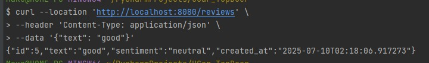
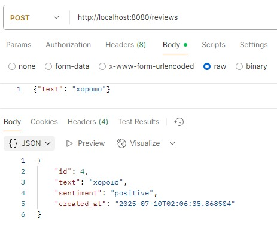

<h3>Тестовое задание для самой лучшей в мире компании UCAR<>TOPDOER

1. Клонируй репозиторий
git clone https://github.com/qbr0q/UCar_TopDoer.git  
cd ТВОЙ_РЕПО  

3. Активируй виртуальное окружение (рекомендуется) 
python3 -m venv venv 
source venv/bin/activate  

4. Установи зависимости 
pip install -r requirements.txt  

5. Запусти проект 
python main.py</h3>

## Примеры curl-запросов
<h4>POST /reviews<h4>
на латинице тк при вводе в курле кириллици выдает ошибку парсинга 

<h4>GET /reviews<h4>

